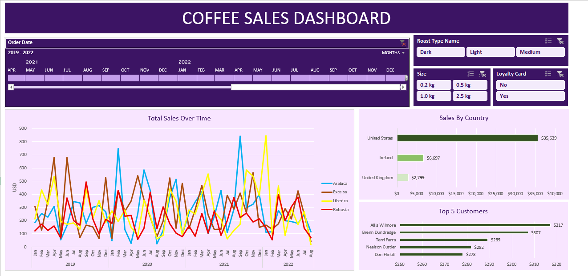

# ☕ Coffee Sales Dashboard (Excel)

An interactive and professional Excel dashboard for analyzing global coffee sales, designed using slicers, timelines, and Excel formulas.

---

## 📁 Files Included

| File                      | Description                             |
|---------------------------|-----------------------------------------|
| `coffee_orders_data.xlsx` | Raw transactional coffee order data     |
| `coffee_orders_dashboard.xlsx` | Interactive Excel dashboard with filters and charts |

---

## 🔍 Dashboard Highlights

- 📅 **Timeline Slicer** (2019–2022): Filter data by month and year
- ☕ **Roast Type Filter**: Dark, Light, Medium
- 📦 **Size Selector**: 0.2kg, 0.5kg, 1.0kg, 2.5kg
- 💳 **Loyalty Card Toggle**: Compare customers with/without loyalty cards
- 🌍 **Sales by Country**: Track revenue in United States, Ireland, and UK
- 👥 **Top 5 Customers**: See the highest spenders
- 📈 **Total Sales Over Time**: Trend lines for Arabica, Robusta, Liberica, Excelsa

---

## ⚙️ Excel Features Used

- `MATCH()`, `INDEX()`, `XLOOKUP()` — for dynamic lookups
- **Slicers & Timeline** — for filtering by dimensions
- **Dynamic Buttons** — for better UX interaction
- **Chart Formatting**:
  - Line chart (monthly trends by bean type)
  - Bar charts (top countries and customers)

---

## ▶️ How to Use

1. Open `coffee_orders_dashboard.xlsx` in Excel.
2. Use **timeline** and **slicers** to filter data interactively.
3. Watch charts and metrics update in real-time.
4. Use buttons to explore different roast types, sizes, and loyalty statuses.

---

## 💡 Perfect For

- Retail sales analysts
- Business dashboards in Excel
- Coffee supply chain reviews
- Learning Excel dashboards and data visualization

---

📌 *Built 100% using Excel with no external tools.*
